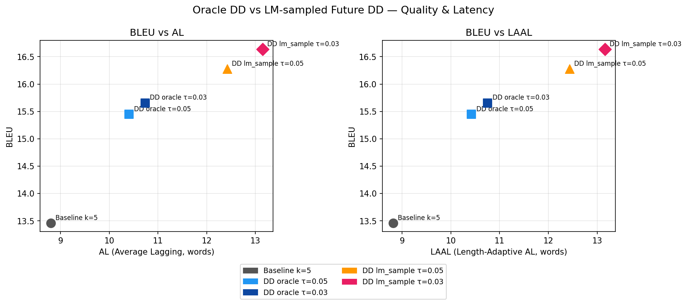

# Oracle DD vs LM-sampled Future DD — Ablation Report

## Summary Table

| Method | BLEU | AL | LAAL | AP | ReadRate | AvgUniqFutures |
|--------|------|-----|------|-----|---------|----------------|
| Baseline k=5 | 13.46 | 8.80 | 8.82 | 0.583 | — | — |
| DD oracle τ=0.05 | 15.45 | 10.41 | 10.42 | 0.619 | 23.5% | 3.66 |
| DD oracle τ=0.03 | 15.66 | 10.74 | 10.75 | 0.623 | 25.5% | 3.66 |
| DD lm_sample τ=0.05 | 16.28 | 12.42 | 12.43 | 0.651 | 38.8% | 3.92 |
| DD lm_sample τ=0.03 | 16.64 | 13.15 | 13.16 | 0.660 | 43.4% | 3.92 |

## Key Questions

### Does lm_sample DD approach oracle DD quality?
- Oracle futures are an upper bound (know the real future).
- LM-sampled futures are plausible but not ground-truth.
- If BLEU gap is small (< 1.0), lm_sample is practically viable.
- If BLEU gap is large, oracle futures provide better future diversity.

### What does AvgUniqFutures tell us?
- LM-sampled futures should be diverse (high temperature → unique futures).
- If AvgUniqFutures ≈ K, futures are diverse (good).
- If AvgUniqFutures < K, LM collapses futures → poor DD signal.

### Read rate vs quality trade-off
- Higher read rate = more conservative = better quality but higher latency.
- If lm_sample has higher read rate than oracle but similar BLEU,
  it may be over-reading due to noisier JS estimates.

## Ablation Interpretation
This ablation answers: can DD work in real-time without oracle futures?
- DD oracle: best-case ceiling (uses actual future words).
- DD lm_sample: realistic deployment (no oracle, LM guesses future).
- The gap measures how much we lose by not knowing the real future.

