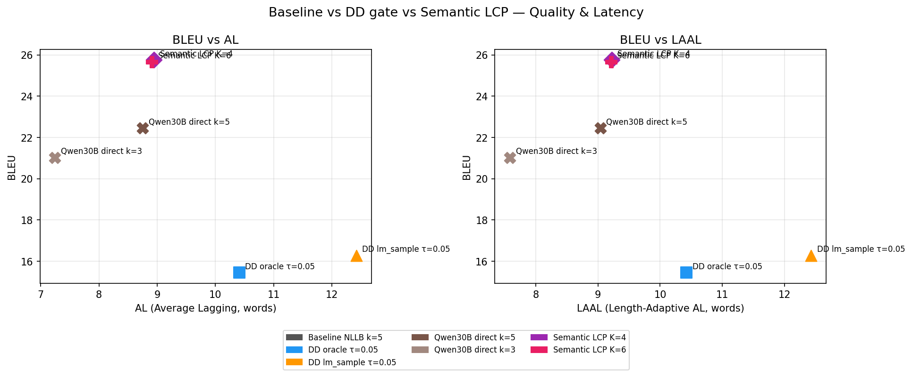

# Baseline vs DD gate vs Semantic LCP — Comparison Report

## Methods

| Method | Description |
|--------|-------------|
| Baseline NLLB k=5 | Pure wait-k, character-by-character NLLB translation |
| DD oracle τ=0.05 | Distribution Divergence gate with oracle futures |
| DD lm_sample τ=0.05 | DD gate with Qwen3-4B sampled futures (no oracle) |
| Semantic LCP K=4 | Qwen30B translates 4 futures; quorum-60% LCP committed |
| Semantic LCP K=6 | Same with 6 futures (higher consensus quality) |

## Results

| Method | BLEU | AL | LAAL | AP | CommitRate | AvgDelta |
|--------|------|-----|------|-----|------------|---------|
| Baseline NLLB k=5 | — | — | — | — | — | —ch |
| DD oracle τ=0.05 | 15.45 | 10.41 | 10.42 | 0.619 | — | —ch |
| DD lm_sample τ=0.05 | 16.28 | 12.42 | 12.43 | 0.651 | — | —ch |
| Qwen30B direct k=5 | 22.45 | 8.75 | 9.04 | 0.663 | 97.8% | 17.3ch |
| Qwen30B direct k=3 | 21.02 | 7.25 | 7.58 | 0.647 | 97.0% | 14.0ch |
| Semantic LCP K=4 | 25.75 | 8.94 | 9.22 | 0.635 | 48.1% | 9.2ch |
| Semantic LCP K=6 | 25.65 | 8.91 | 9.21 | 0.669 | 50.5% | 9.3ch |

## Key Interpretation

### What Semantic LCP adds over DD

- DD gate: decides READ vs COMMIT based on JS divergence signal.
- Semantic LCP: decides WHAT to commit based on translation consensus.
- Semantic LCP uses Qwen30B (much higher quality than NLLB) for translation.
- If Semantic LCP BLEU >> DD BLEU at similar latency: quality gain from Qwen30B.
- If Semantic LCP BLEU ≈ DD BLEU: the gating mechanism (not translation quality) is the bottleneck.

### AvgDelta

- Characters committed per step. Higher = more aggressive commits.
- Very low AvgDelta may indicate over-conservatism (too many READ steps).

