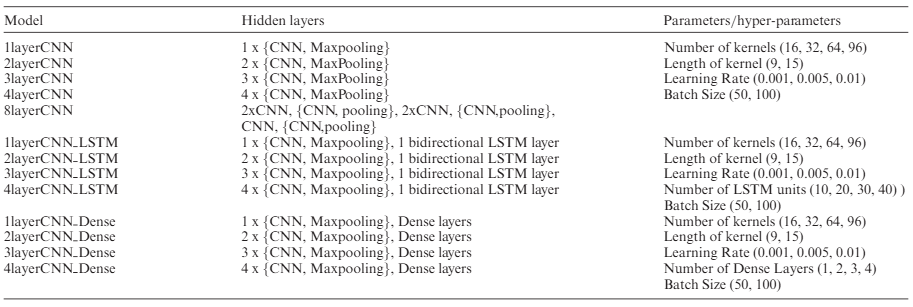

# Project Report Rubric

**Template for report submission:** https://www.overleaf.com/read/btddtdztdrgs

---

## Overview and Context

### Abstract
| Proposal (1–2 pages) | Midterm Report (4–5 pages) | Final Report (8–10 pages) |
|---|---|---|
| The problem statement is clear and concise, understandable to a general audience. | The problem statement is understandable to non-experts. | The problem statement is clearly articulated and understandable to a non-expert audience. |

### Motivation & Objectives
| Proposal (1–2 pages) | Midterm Report (4–5 pages) | Final Report (8–10 pages) |
|---|---|---|
| Students briefly explain why the problem is important or relevant and outline at least one broad goal or objective (even if quantitative details are not yet finalized). | Students articulate why the problem is important or who benefits and state at least one qualitative or quantitative objective. | Contextual motivation is provided and qualitative and quantitative objectives are clearly stated and related to the problem. |

---

## Related Work and Background

### Literature Review
| Proposal (1–2 pages) | Midterm Report (4–5 pages) | Final Report (8–10 pages) |
|---|---|---|
| Students cite at least one prior work relevant to their project. A short explanation of how this work relates to their project is included. | Students cite 1–2 key papers related to their project, with brief connections to the problem. | Students identify relevant prior work, preferably grouping related research lines or methodologies. Proper citation and clear connections to the problem are included. |

### Background
| Proposal (1–2 pages) | Midterm Report (4–5 pages) | Final Report (8–10 pages) |
|---|---|---|
| If applicable, students may reference an evaluation metric or baseline related to their problem. | At least one cited paper connects the evaluation metric or baseline to the problem. | Cited papers explicitly connect the evaluation metric and baseline models to the problem statement. |

---

## Methodology

### Model Description
| Proposal (1–2 pages) | Midterm Report (4–5 pages) | Final Report (8–10 pages) |
|---|---|---|
| A high-level description of the approach or model is provided. Diagrams/tables optional but encouraged. | Basic explanation of the proposed model (inputs/outputs). Diagrams/tables encouraged. | Clear diagrams/tables describing inputs, outputs, and structure. Output map shapes and parameter counts included. |

**Model description should follow a table format like this:**

### Dataset
| Proposal (1–2 pages) | Midterm Report (4–5 pages) | Final Report (8–10 pages) |
|---|---|---|
| Students identify a potential data source and briefly describe how it relates to the problem. | Data source is identified and basic preparation steps outlined. | Steps for training and evaluation are explicitly stated, including batch sampling. Dataset citation provided. |

### Evaluation Metric
| Proposal (1–2 pages) | Midterm Report (4–5 pages) | Final Report (8–10 pages) |
|---|---|---|
| The metric students plan to use for assessing success is mentioned. | The chosen metric is stated, with a simple explanation of its relevance. | Mathematical definitions with variables clearly labeled and tied to the problem. |

### Loss Function
| Proposal (1–2 pages) | Midterm Report (4–5 pages) | Final Report (8–10 pages) |
|---|---|---|
| Not required but may be mentioned. | Mentioned briefly if applicable. | Loss and optimization described with mathematical precision. |

### Experimental Depth & Iteration
| Proposal (1–2 pages) | Midterm Report (4–5 pages) | Final Report (8–10 pages) |
|---|---|---|
| Students state at least one planned model/experiment variation beyond the baseline. | Students present evidence of initial iterations (e.g., at least two runs, adjustments, or configurations attempted). | Students demonstrate multiple experimental attempts or configurations, showing development beyond a single training run. |

---

## Baseline and Extensions

### Baseline Selection & Evaluation
| Proposal (1–2 pages) | Midterm Report (4–5 pages) | Final Report (8–10 pages) |
|---|---|---|
| Students propose one or more potential baselines for comparison. | **MANDATORY:** Students implement and explain their chosen baseline. | Students justify their choice of baseline, referencing relevant papers or models. Baseline evaluations are conducted systematically. |

### Implemented Extensions/Experiments
| Proposal (1–2 pages) | Midterm Report (4–5 pages) | Final Report (8–10 pages) |
|---|---|---|
| Students describe 1–2 initial ideas for how their work might extend beyond the baseline. | High-level description of extensions/experiments to be conducted. | Results show improvement over baselines or justified analysis of failures. |

### Baseline Reproduction Evidence
| Proposal (1–2 pages) | Midterm Report (4–5 pages) | Final Report (8–10 pages) |
|---|---|---|
| Students show initial results/plots confirming that their baseline results are their own. | Students show initial results/plots confirming that their baseline results are their own. | Students provide clear, original baseline output (plots/logs/metrics) confirming reproduction. |

---

## Results and Analysis

### Results
| Proposal (1–2 pages) | Midterm Report (4–5 pages) | Final Report (8–10 pages) |
|---|---|---|
| Anticipated results described in general terms (e.g., expected improvement over baseline). Not required to include validation results. | Preliminary results or progress metrics encouraged (e.g., sample outputs or early plots). | Separate and clear results for training and validation (plots/tables). Key findings visualized. |

### Error / Failure Case Analysis
| Proposal (1–2 pages) | Midterm Report (4–5 pages) | Final Report (8–10 pages) |
|---|---|---|
| | | At least one failure mode or error pattern is identified and discussed. |

### Sensitivity / Ablation Analysis
| Proposal (1–2 pages) | Midterm Report (4–5 pages) | Final Report (8–10 pages) |
|---|---|---|
| | | At least one comparison demonstrating how performance changes with a design choice (e.g., model variant, hyperparameter). |

---

## Discussion
| Proposal (1–2 pages) | Midterm Report (4–5 pages) | Final Report (8–10 pages) |
|---|---|---|
| Students briefly discuss potential challenges or risks in executing the proposed project. | Students briefly discuss challenges so far and potential risks moving forward. | The team explains the significance of results, potential risks, and sensitivity of results to input changes, discussing limitations where applicable. |

---

## Future Directions
| Proposal (1–2 pages) | Midterm Report (4–5 pages) | Final Report (8–10 pages) |
|---|---|---|
| Planned Work: A clear outline of next steps to be done before the midterm report. | Planned Next Steps: Students identify 2–3 specific actions to move forward. | Students identify areas for future exploration or improvement based on results and limitations. |

---

## Conclusion
| Proposal (1–2 pages) | Midterm Report (4–5 pages) | Final Report (8–10 pages) |
|---|---|---|
| | | Students effectively summarize their key findings, progress made, and how the work relates to their objectives. |

---

## Bonus Contributions (Optional)

### Visualization
| Proposal (1–2 pages) | Midterm Report (4–5 pages) | Final Report (8–10 pages) |
|---|---|---|
| | | Compelling and clearly labeled visualizations (embeddings, features) may earn extra points. |

### Extra Experimental Exploration
| Proposal (1–2 pages) | Midterm Report (4–5 pages) | Final Report (8–10 pages) |
|---|---|---|
| | | Significant additional experiments or analyses beyond required work may earn extra points. |

---

## Administrative Details

### Bibliography
| Proposal (1–2 pages) | Midterm Report (4–5 pages) | Final Report (8–10 pages) |
|---|---|---|
| At least one citation (preferably two). | Students include citations for all referenced work (2–3 minimum). | References formatted correctly and thoughtfully selected. |

### Team Contributions
| Proposal (1–2 pages) | Midterm Report (4–5 pages) | Final Report (8–10 pages) |
|---|---|---|
| If applicable, list initial roles/responsibilities. | Provide basic role breakdown. | Provide contribution breakdown by member. |

### GitHub
| Proposal (1–2 pages) | Midterm Report (4–5 pages) | Final Report (8–10 pages) |
|---|---|---|
| Begin a GitHub repository if modeling has started and include link. | Include GitHub link. | Include GitHub link. |
